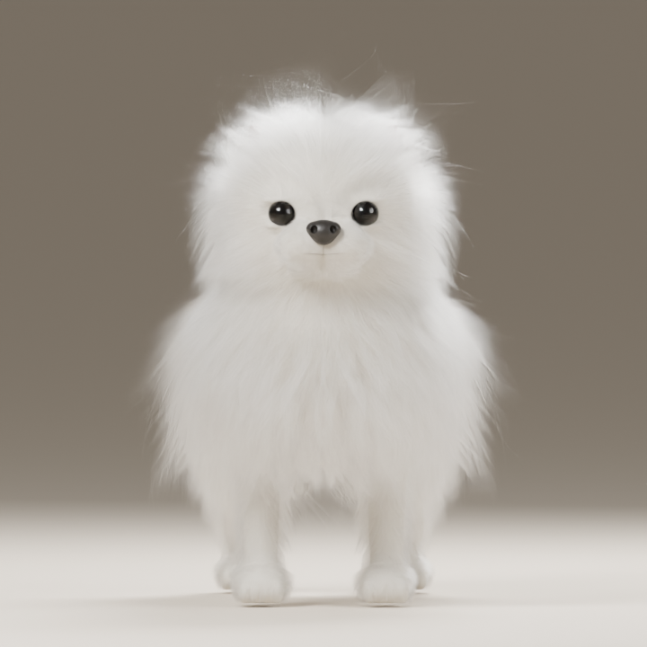
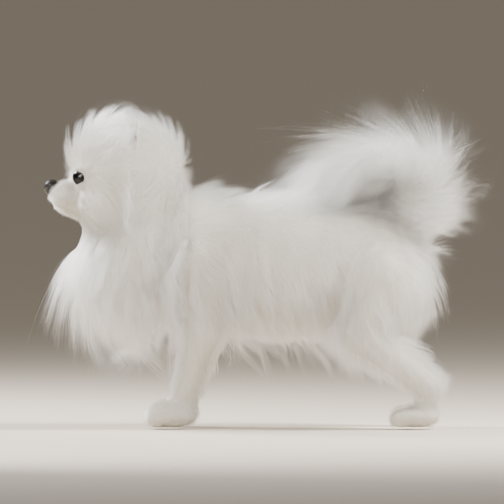
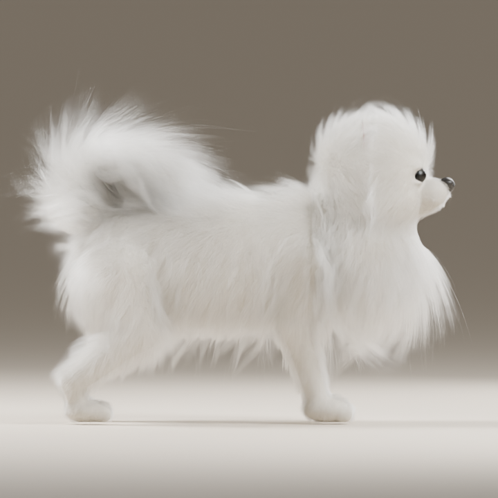
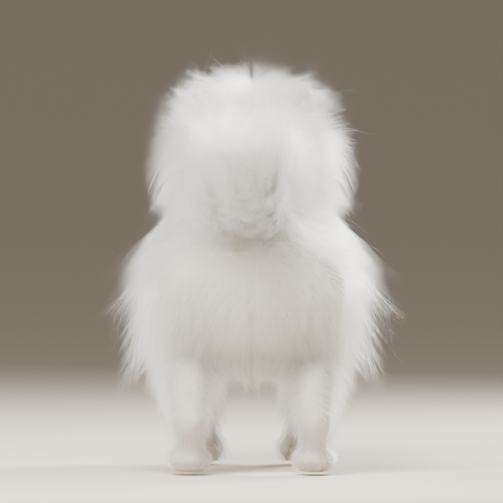
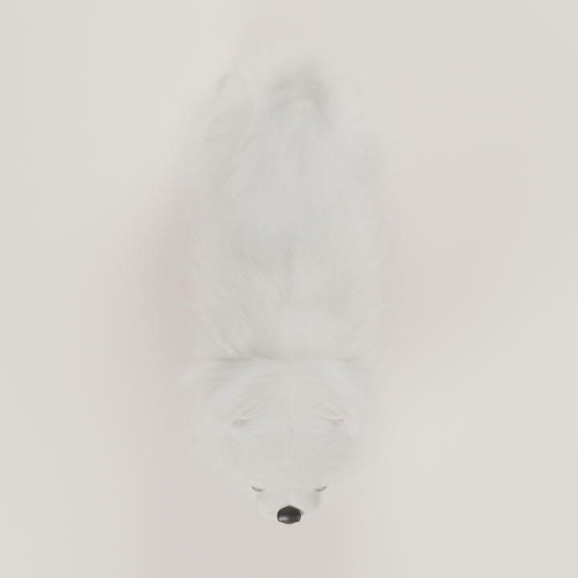
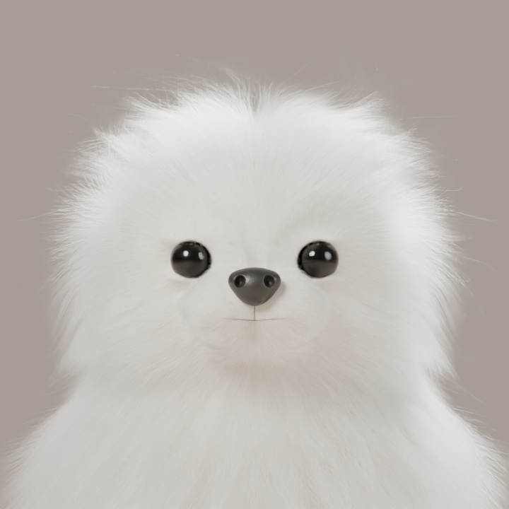

# 모델링 미리보기

모두 모델링 작업에서 생성한 실제 Blender 렌더입니다. 개인 참고 사진과 외부 모델의 렌더는 포함하지 않습니다.

## 최신: fullbody05 — 입을 다문 기본형

전신 형태와 얼굴·털을 수정한 작업본입니다. 리깅·애니메이션은 없으며, 기준 사진과 완전히 같은 비율이나 외형으로 검증된 상태는 아닙니다.

| 정면 | 측면 |
| --- | --- |
|  |  |
| 반대 측면 | 후면 |
|  |  |
| 위 | 얼굴 확대 |
|  |  |

이전 입을 연 전신 렌더는 [fullbody04](fullbody04)에 보관합니다.

## 초기 실험: v01 · v02

이 폴더의 `ogong_blockout_v01_*`, `ogong_blockout_v02_*`는 초기 형태 실험입니다. 요청한 유사도와 세부 품질을 충족하지 못해 현재 제작 기반으로 채택하지 않았습니다. 진행 기록으로만 남겨 둡니다.
