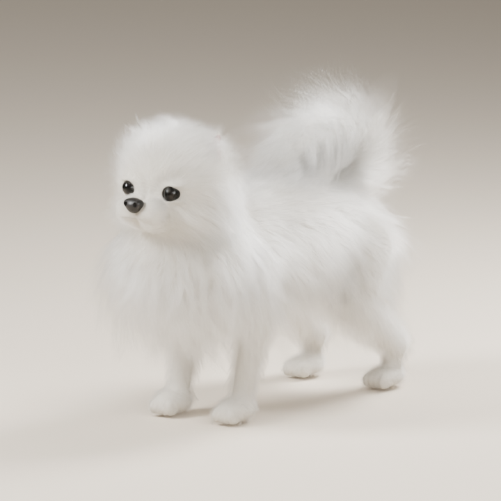

# Desktop Pet — 오공이

흰 포메라니안 오공이를 닮은 3D 캐릭터가 **Windows 바탕화면에서만** 활동하는 데스크톱 펫 프로젝트입니다. 다른 프로그램 창을 열면 그 창이 강아지를 가리는 동작을 목표로 합니다.

현재는 **3D 모델링 연구와 앱 설계 단계**입니다. 실행 가능한 Windows 앱은 아직 없습니다. 최신 모델은 입을 다문 기본형 `fullbody05`이며, 사진·다각도 그림을 참고해 전신 비율과 얼굴, 부위별 털을 조정한 작업본입니다. 기준 이미지와의 완전한 일치나 실사 수준의 유사도를 검증한 완성본은 아닙니다.

## 현재 작업

기본 표정은 입을 다문 상태입니다. [닫힌 입 작업 기록](docs/CLOSED_MOUTH.md)에 주둥이·턱·입선 변경을 정리했습니다. 입을 연 이전 모델은 별도로 보관합니다.

- 머리·목·몸통·네 다리를 잇는 연속 표면과 등 위로 말리는 꼬리
- 눈·각막·눈꺼풀, 코·콧구멍, 입·혀의 형태와 재질
- 얼굴·가슴·몸통·다리·귀·꼬리의 Blender Hair Curves
- 정면·양 측면·후면·위·사선·얼굴 확대 렌더 7장
- 메시 연결 상태, 좌우 대칭, 털 좌표와 참조를 검사하는 스크립트

[최신 렌더 모음](Previews/fullbody05) · [전신 비율 작업 기록](docs/FULLBODY_PROPORTIONS.md)

고밀도 조형과 Blender 전용 털을 사용하는 모델입니다. 변형용 메시 정리, 리깅, 걷기·앉기·잠자기 애니메이션, Unity용 경량화는 후속 작업입니다.

## 저장소 구조

| 경로 | 내용 |
| --- | --- |
| [ArtSource](ArtSource/README.md) | Blender·Python 모델 생성, 털, 렌더, 검수 스크립트와 이전 실험 기록 |
| [Previews](Previews/README.md) | 실제 3D 렌더; 최신 작업과 초기 실험을 구분해 보관 |
| [docs/PROJECT_PLAN.md](docs/PROJECT_PLAN.md) | Windows 바탕화면 전용 앱 범위와 개발 단계 |
| [docs/3D_ASSET_PLAN.md](docs/3D_ASSET_PLAN.md) | 모델·털·리깅·애니메이션 제작 계획 |
| [docs/REPRODUCING.md](docs/REPRODUCING.md) | 실행 환경, 파일 의존성, 작업 순서 |

## 다음 단계

1. 기준 이미지와 비교하며 체형·얼굴·털의 유사도를 개선합니다.
2. 관절 변형에 맞게 메시를 정리하고 걷기·앉기·잠자기·클릭 반응을 제작합니다.
3. Unity + C#으로 바탕화면 표시, 이동, 입력, 드래그를 구현합니다.
4. 표시 크기와 성능에 맞춰 모델과 털을 경량화합니다.

## 포함하지 않는 파일

개인 참고 사진, 외부에서 받은 참고 모델, 사진이 내장될 수 있는 `.blend`, 중간 데이터와 대용량 전달 ZIP은 Git에서 제외합니다. 따라서 이 저장소는 제작 소스와 작업 기록이며, 복제만으로 모든 이전 장면을 즉시 열 수 있는 패키지는 아닙니다. 모델 전달본은 별도로 보관합니다.

기존 [MIT 라이선스](LICENSE)를 유지합니다. 외부 참고 자산은 이 저장소에 포함하거나 재배포하지 않습니다.
